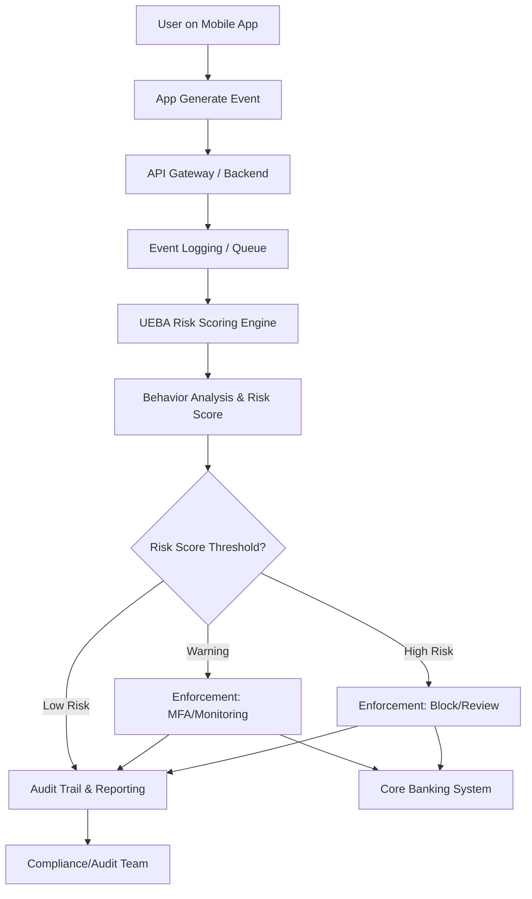

# Proposal

## **Penerapan User and Entity Behavior Analytics (UEBA) untuk Penguatan Keamanan dan Deteksi Fraud pada Digital Banking**

---

### **1. Latar Belakang**

Transformasi digital di sektor perbankan memangkas proses layanan, namun juga meningkatkan risiko keamanan siber dan fraud digital. Fraudster kini cenderung mengeksploitasi perilaku abnormal user/device, yang sulit dideteksi dengan rule statis seperti device ID atau threshold transaksi.
Selain itu, regulasi privasi dan policy OS modern membatasi tracking berbasis hardware identifier, sehingga fraudster bisa menghapus histori risiko hanya dengan reinstall aplikasi.

---

### **2. Tujuan Proposal**

* **Meningkatkan deteksi fraud berbasis perilaku (behavioral analytics)**
* **Menerapkan risk scoring adaptif** untuk user dan perangkat
* **Memastikan audit trail perilaku dan risk score** demi compliance dan investigasi
* **Mengotomatisasi enforcement berbasis risiko** (misal: blokir, MFA, limitasi fitur) secara real-time

---

### **3. Konsep & Definisi UEBA**

**UEBA (User and Entity Behavior Analytics)** adalah sistem yang menganalisis aktivitas dan pola perilaku user serta device/entity untuk mendeteksi anomali dan potensi fraud secara dinamis, dengan cara membandingkan terhadap baseline perilaku normal serta mengidentifikasi deviasi signifikan.

---

### **4. Ruang Lingkup**

* **Sumber Data:** Event log aplikasi mobile, backend API, transaction log, device fingerprint (tanpa hardware ID sensitif)
* **Behavior yang Dianalisis:**

  * Frekuensi reaktivasi akun (install–uninstall)
  * Pergantian device/fingerprint
  * Percobaan login gagal
  * Device sharing (multi user per device)
  * Lokasi/IP anomali
  * Pola transaksi abnormal
* **Target Entity:** User ID, Account Number, Device Fingerprint

---

### **5. Arsitektur & Metode UEBA**

#### **Event Flow dan Risk Scoring UEBA**



**Penjelasan Singkat:**
Semua event perilaku user dikirim ke backend dan event store, lalu dianalisis UEBA untuk risk scoring.
Jika risk score tinggi, enforcement (blokir/MFA/monitoring) langsung dijalankan secara otomatis ke core banking.
Seluruh aktivitas dan enforcement dicatat dalam audit trail untuk compliance/regulator.

---

### **6. Formulasi Risk Scoring**

| Event                      | Rule/Threshold           | Risk Score |
| -------------------------- | ------------------------ | ---------- |
| Reactivation >2x/30 hari   | per user                 | +30        |
| Device baru >3x/30 hari    | per user                 | +20        |
| Failed login >5x/24 jam    | per user                 | +10        |
| Device fingerprint >2 akun | per device               | +40        |
| Akses dari IP/negara baru  | per event                | +20        |
| Transaksi outlier          | deviasi dari pola normal | +50        |

* **< 30:** Normal
* **30–60:** Warning (MFA/Limitasi)
* **> 60:** High Risk (blokir/review manual)

---

### **7. Pipeline Risk Scoring: Simulasi & Output**

#### **Contoh Data Event Log & Kode**

```python
from datetime import datetime, timedelta

event_log = [
    # Simulasi event userA - perilaku cukup aktif, tapi tidak melewati threshold warning
    ('userA', 'dev1', 'reactivation', datetime.now() - timedelta(days=2)),
    ('userA', 'dev1', 'reactivation', datetime.now() - timedelta(days=1)),
    ('userA', 'dev2', 'new_device',   datetime.now() - timedelta(days=5)),
    ('userA', 'dev3', 'new_device',   datetime.now() - timedelta(days=3)),
    ('userA', 'dev4', 'new_device',   datetime.now() - timedelta(hours=1)),
    ('userA', 'dev4', 'failed_login', datetime.now() - timedelta(hours=1)),
    ('userA', 'dev4', 'failed_login', datetime.now() - timedelta(hours=1)),
    ('userA', 'dev4', 'failed_login', datetime.now() - timedelta(hours=1)),
    ('userA', 'dev4', 'failed_login', datetime.now() - timedelta(hours=1)),
    ('userA', 'dev4', 'failed_login', datetime.now() - timedelta(hours=1)),
    ('userA', 'dev4', 'failed_login', datetime.now() - timedelta(hours=1)),
    # userB - normal activity
    ('userB', 'dev5', 'reactivation', datetime.now() - timedelta(days=10)),
    ('userB', 'dev5', 'new_device',   datetime.now() - timedelta(days=10)),
    ('userB', 'dev5', 'failed_login', datetime.now() - timedelta(days=1)),
]

RISK_SCORE_RULES = {
    'reactivation': 30,
    'new_device': 20,
    'failed_login': 10,
}

def calc_user_risk(user_id, event_log):
    now = datetime.now()
    last30d = now - timedelta(days=30)
    last24h = now - timedelta(hours=24)
    events = [e for e in event_log if e[0] == user_id]
    react_count = sum(1 for e in events if e[2] == 'reactivation' and e[3] >= last30d)
    new_devs = set(e[1] for e in events if e[2] == 'new_device' and e[3] >= last30d)
    failed_login_count = sum(1 for e in events if e[2] == 'failed_login' and e[3] >= last24h)
    
    score = 0
    if react_count > 2:
        score += RISK_SCORE_RULES['reactivation']
    if len(new_devs) > 3:
        score += RISK_SCORE_RULES['new_device']
    if failed_login_count > 5:
        score += RISK_SCORE_RULES['failed_login']
    return {
        'reactivation_30d': react_count,
        'unique_new_device_30d': len(new_devs),
        'failed_login_24h': failed_login_count,
        'risk_score': score
    }

user_ids = sorted(set(e[0] for e in event_log))
for user in user_ids:
    result = calc_user_risk(user, event_log)
    print(f"User: {user}")
    print(f"  Reactivation (30d): {result['reactivation_30d']}")
    print(f"  Unique new device (30d): {result['unique_new_device_30d']}")
    print(f"  Failed login (24h): {result['failed_login_24h']}")
    print(f"  >> Total Risk Score: {result['risk_score']}")
    if result['risk_score'] >= 30:
        print("  [!] Enforcement: Block or force MFA/review")
    elif result['risk_score'] > 0:
        print("  [!] Enforcement: Warning/monitor")
    else:
        print("  Status: Normal\n")
```

#### **Output Simulasi (Update):**

```
User: userA
  Reactivation (30d): 2
  Unique new device (30d): 3
  Failed login (24h): 6
  >> Total Risk Score: 10
  [!] Enforcement: Warning/monitor

User: userB
  Reactivation (30d): 1
  Unique new device (30d): 1
  Failed login (24h): 0
  >> Total Risk Score: 0
  Status: Normal
```

**Penjelasan Hasil Simulasi:**

* **userA** cukup aktif (beberapa reaktivasi, device baru, 6 kali gagal login), namun risk score hanya 10 (warning/monitor).
* **userB** pola normal, tidak perlu tindakan khusus.

---

### **8. Benefit & Keunggulan**

* **Deteksi fraud lebih proaktif, adaptif, dan real-time**
* **Mengurangi false positive/negative** secara signifikan
* **Audit trail lengkap** untuk kebutuhan compliance & investigasi
* **Dapat diintegrasikan langsung ke core banking, fraud analytics, dan sistem keamanan existing**

---

### **9. Tantangan & Mitigasi**

* **Integrasi data lintas sistem** (app, backend, fraud ops)
* **Tuning threshold & rule** agar sesuai konteks bisnis
* **Harus comply** ke regulasi privasi/data protection

---

### **10. Referensi Eksternal**

* **Gartner UEBA Market Guide**
* **NIST SP 800-53 Rev.5**
* **ACFE Fraud Risk Management Guide**
* **OWASP AppSensor & MSTG**

---

### **11. Penutup**

Penerapan UEBA pada digital banking memungkinkan deteksi fraud dan perilaku anomali secara presisi, real-time, dan adaptif—serta memenuhi tuntutan compliance. Simulasi pipeline membuktikan pendekatan UEBA dapat diimplementasikan secara efisien dan scalable, memberi dampak signifikan pada keamanan perbankan digital.

---

**Lampiran:**

* Flowchart integrasi (UEBA pipeline)
* Kode pipeline simulasi
* Tabel risk scoring dan rule
