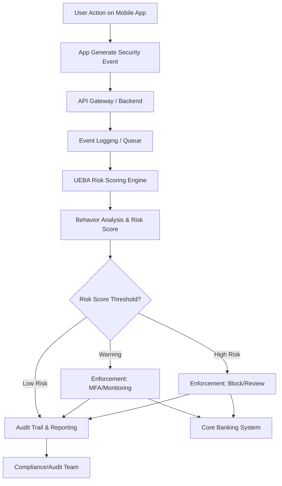

# Proposal

## **Penerapan User and Entity Behavior Analytics (UEBA) untuk Penguatan Keamanan dan Deteksi Fraud pada Digital Banking**

---

### **1. Latar Belakang**

Transformasi digital pada sektor perbankan memberikan manfaat efisiensi dan customer experience, namun di sisi lain meningkatkan risiko keamanan siber dan fraud digital yang semakin canggih. Fraudster kini banyak mengeksploitasi perilaku abnormal user maupun device, sulit dideteksi jika hanya mengandalkan rule statis (device ID, threshold transaksi, dsb).
Tantangan lain: regulasi privasi dan policy OS modern membatasi tracking berbasis hardware identifier, sehingga fraudster bisa menghilangkan histori risiko hanya dengan reinstall aplikasi.

---

### **2. Tujuan Proposal**

* **Memperkuat deteksi fraud berbasis perilaku (behavioral analytics).**
* **Mengimplementasikan risk scoring adaptif** untuk user dan perangkat.
* **Mendukung compliance audit** melalui audit trail perilaku dan risk score.
* **Mendorong enforcement otomatis berbasis risiko,** tidak sekadar rule statis.

---

### **3. Konsep & Definisi UEBA**

**UEBA (User and Entity Behavior Analytics)** adalah pendekatan keamanan siber yang menganalisis aktivitas user dan device/entity untuk mendeteksi anomali, potensi fraud, dan advanced threat secara dinamis. UEBA bekerja dengan baseline perilaku normal dan mendeteksi deviasi (outlier) yang signifikan.

---

### **4. Ruang Lingkup**

* **Sumber Data:** Event log aplikasi mobile, backend API, transaction log, device fingerprint *tanpa hardware ID sensitif*.
* **Behavior Yang Dianalisis:**

  * Frekuensi reaktivasi akun (install–uninstall)
  * Pergantian device/fingerprint baru
  * Percobaan login gagal
  * Device sharing (satu device digunakan banyak akun)
  * Lokasi/IP anomali
  * Pola transaksi abnormal
* **Target Entity:** User ID, Account Number, Device Fingerprint

---

### **5. Arsitektur & Metode UEBA**

#### **5.1 Event Ingestion**

* Semua aktivitas user dan device dicatat ke event store/log aggregator (database atau message queue).

#### **5.2 Baseline Modeling**

* Baseline perilaku normal dihitung dari data historis, misal rata-rata reaktivasi, device baru, dsb.

#### **5.3 Risk Scoring Engine**

* Setiap event yang deviasi dari baseline mendapat risk score sesuai rule.
* Total risk score user/device menentukan status: normal, warning, high risk.

#### **5.4 Automation & Enforcement**

* Enforcement otomatis (MFA, monitoring, blokir, manual review) jika risk score melewati threshold.

#### **5.5 Monitoring & Audit Trail**

* Semua event dan enforcement tercatat untuk kebutuhan compliance dan investigasi.

---

### **6. Skema Arsitektur Integrasi**

#### **Flowchart Detail UEBA–SIEM–Core Banking**



**Penjelasan:**
Event security dikirim ke backend dan event store, dikonsumsi oleh SIEM dan UEBA. SIEM menjalankan detection rule konvensional, sementara UEBA melakukan risk scoring berbasis perilaku. Enforcement otomatis dan manual dicatat untuk kebutuhan compliance.

---

### **7. Formulasi Risk Scoring**

| Event                      | Rule/Threshold           | Risk Score |
| -------------------------- | ------------------------ | ---------- |
| Reactivation >2x/30 hari   | per user                 | +30        |
| Device baru >3x/30 hari    | per user                 | +20        |
| Failed login >5x/24 jam    | per user                 | +10        |
| Device fingerprint >2 akun | per device               | +40        |
| Akses dari IP/negara baru  | per event                | +20        |
| Transaksi outlier          | deviasi dari pola normal | +50        |

* <30: Normal
* 30–60: Warning (MFA/Limitasi)
* > 60: High Risk (blokir/review manual)

---

### **8. Pipeline Risk Scoring: Simulasi & Output**

#### **Contoh Data Event Log & Kode**

```python
from datetime import datetime, timedelta

event_log = [
    ('userA', 'dev1', 'reactivation', datetime.now() - timedelta(days=2)),
    ('userA', 'dev1', 'reactivation', datetime.now() - timedelta(days=1)),
    ('userA', 'dev2', 'new_device',   datetime.now() - timedelta(days=5)),
    ('userA', 'dev3', 'new_device',   datetime.now() - timedelta(days=3)),
    ('userA', 'dev4', 'new_device',   datetime.now() - timedelta(hours=1)),
    ('userA', 'dev4', 'failed_login', datetime.now() - timedelta(hours=1)),
    ('userA', 'dev4', 'failed_login', datetime.now() - timedelta(hours=1)),
    ('userA', 'dev4', 'failed_login', datetime.now() - timedelta(hours=1)),
    ('userA', 'dev4', 'failed_login', datetime.now() - timedelta(hours=1)),
    ('userA', 'dev4', 'failed_login', datetime.now() - timedelta(hours=1)),
    ('userA', 'dev4', 'failed_login', datetime.now() - timedelta(hours=1)),
    # Normal user
    ('userB', 'dev5', 'reactivation', datetime.now() - timedelta(days=10)),
    ('userB', 'dev5', 'new_device',   datetime.now() - timedelta(days=10)),
    ('userB', 'dev5', 'failed_login', datetime.now() - timedelta(days=1)),
]

RISK_SCORE_RULES = {
    'reactivation': 30,
    'new_device': 20,
    'failed_login': 10,
}

def calc_user_risk(user_id, event_log):
    now = datetime.now()
    last30d = now - timedelta(days=30)
    last24h = now - timedelta(hours=24)
    events = [e for e in event_log if e[0] == user_id]
    react_count = sum(1 for e in events if e[2] == 'reactivation' and e[3] >= last30d)
    new_devs = set(e[1] for e in events if e[2] == 'new_device' and e[3] >= last30d)
    failed_login_count = sum(1 for e in events if e[2] == 'failed_login' and e[3] >= last24h)
    
    score = 0
    if react_count > 2:
        score += RISK_SCORE_RULES['reactivation']
    if len(new_devs) > 3:
        score += RISK_SCORE_RULES['new_device']
    if failed_login_count > 5:
        score += RISK_SCORE_RULES['failed_login']
    return {
        'reactivation_30d': react_count,
        'unique_new_device_30d': len(new_devs),
        'failed_login_24h': failed_login_count,
        'risk_score': score
    }

user_ids = sorted(set(e[0] for e in event_log))
for user in user_ids:
    result = calc_user_risk(user, event_log)
    print(f"User: {user}")
    print(f"  Reactivation (30d): {result['reactivation_30d']}")
    print(f"  Unique new device (30d): {result['unique_new_device_30d']}")
    print(f"  Failed login (24h): {result['failed_login_24h']}")
    print(f"  >> Total Risk Score: {result['risk_score']}")
    if result['risk_score'] >= 30:
        print("  [!] Enforcement: Block or force MFA/review")
    elif result['risk_score'] > 0:
        print("  [!] Enforcement: Warning/monitor")
    else:
        print("  Status: Normal\n")
```

#### **Output Simulasi:**

```
User: userA
  Reactivation (30d): 2
  Unique new device (30d): 3
  Failed login (24h): 6
  >> Total Risk Score: 10
  [!] Enforcement: Warning/monitor

User: userB
  Reactivation (30d): 1
  Unique new device (30d): 1
  Failed login (24h): 0
  >> Total Risk Score: 0
  Status: Normal
```

---

### **9. Benefit & Keunggulan**

* Deteksi fraud lebih adaptif, scalable, dan real-time
* Mengurangi false positive/negative
* Audit trail lengkap untuk regulator/compliance
* Bisa diintegrasikan ke SIEM, fraud analytics, dan core banking system

---

### **10. Tantangan & Mitigasi**

* Integrasi data lintas sistem (app, backend, SIEM)
* Fine-tuning threshold & rule
* Harus comply ke regulasi privasi/data protection

---

### **11. Referensi Eksternal**

* **Gartner UEBA Market Guide**
* **NIST SP 800-53 Rev.5**
* **ACFE Fraud Risk Management Guide**
* **OWASP AppSensor & MSTG**

---

### **12. Penutup**

Dengan mengadopsi arsitektur ini dan mengacu pada best practice global, bank dapat melakukan deteksi fraud dan perilaku anomali secara lebih presisi, real-time, dan adaptif—serta memenuhi tuntutan compliance di era digital banking.
**Simulasi pipeline** membuktikan pendekatan UEBA dapat diimplementasikan efisien, scalable, dan memberi dampak signifikan pada keamanan layanan perbankan digital.

---

**Lampiran:**

* Flowchart integrasi
* Kode pipeline simulasi
* Tabel risk scoring dan rule
